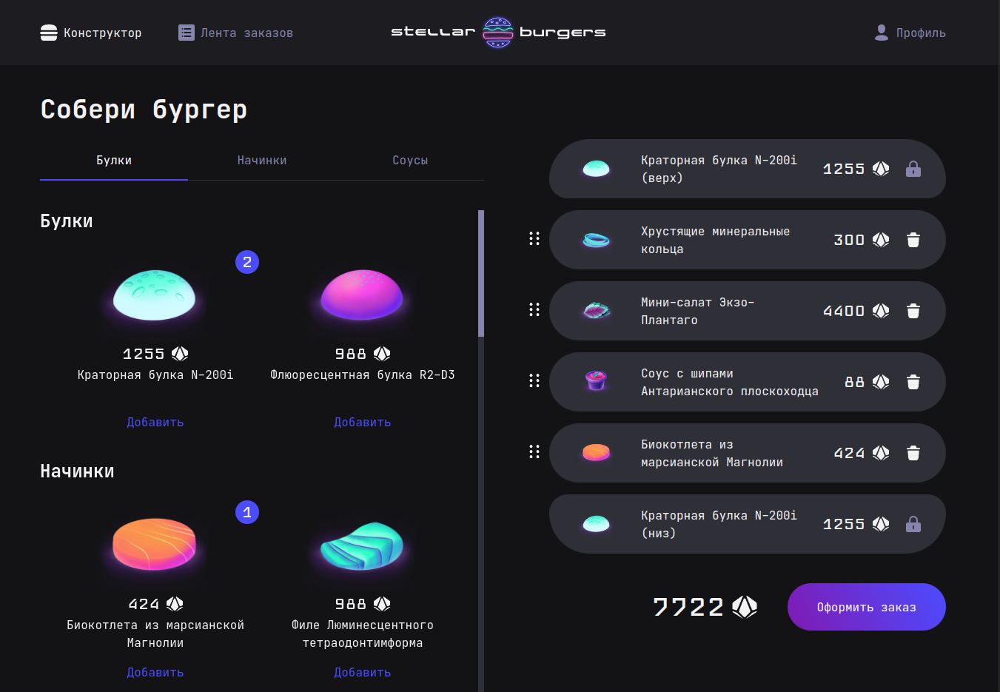
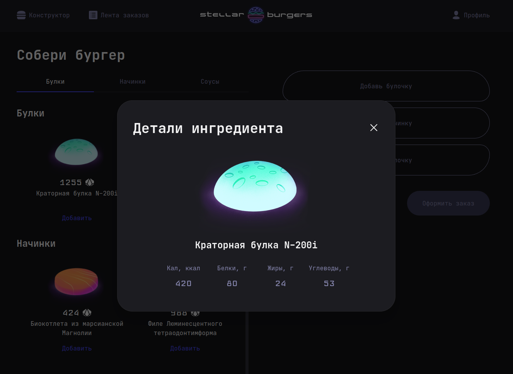
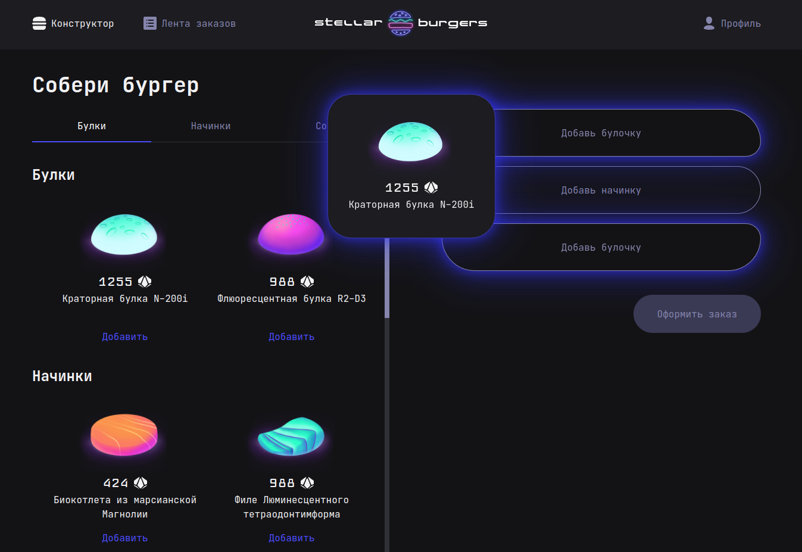
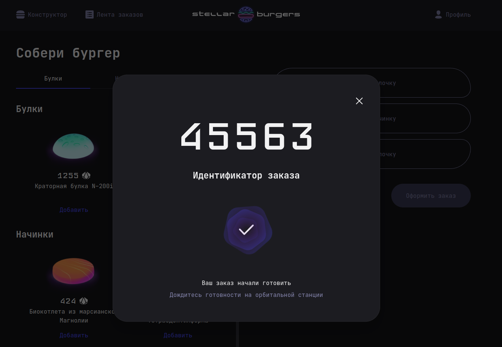
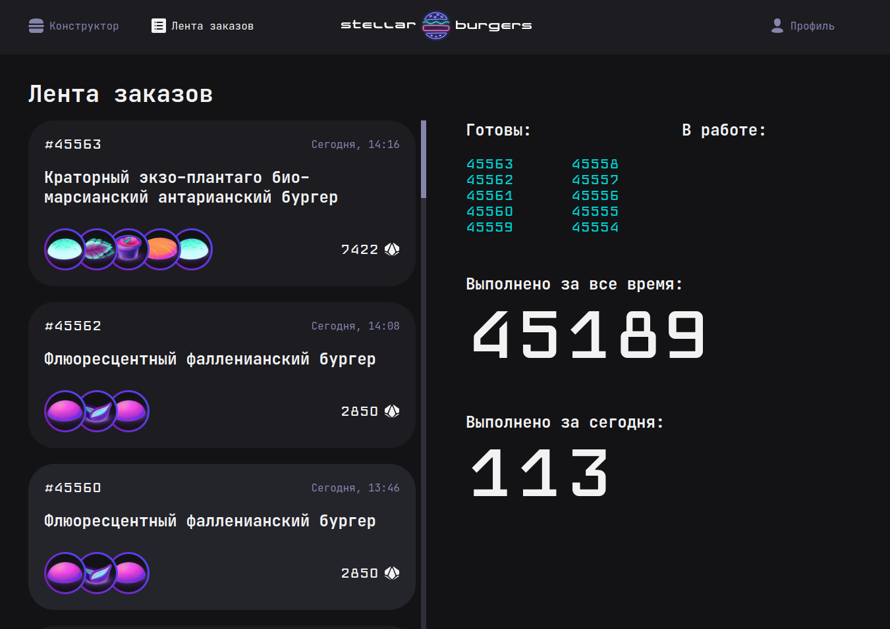
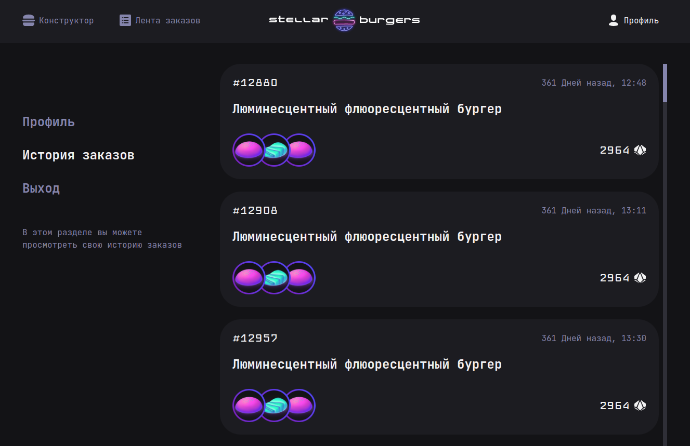
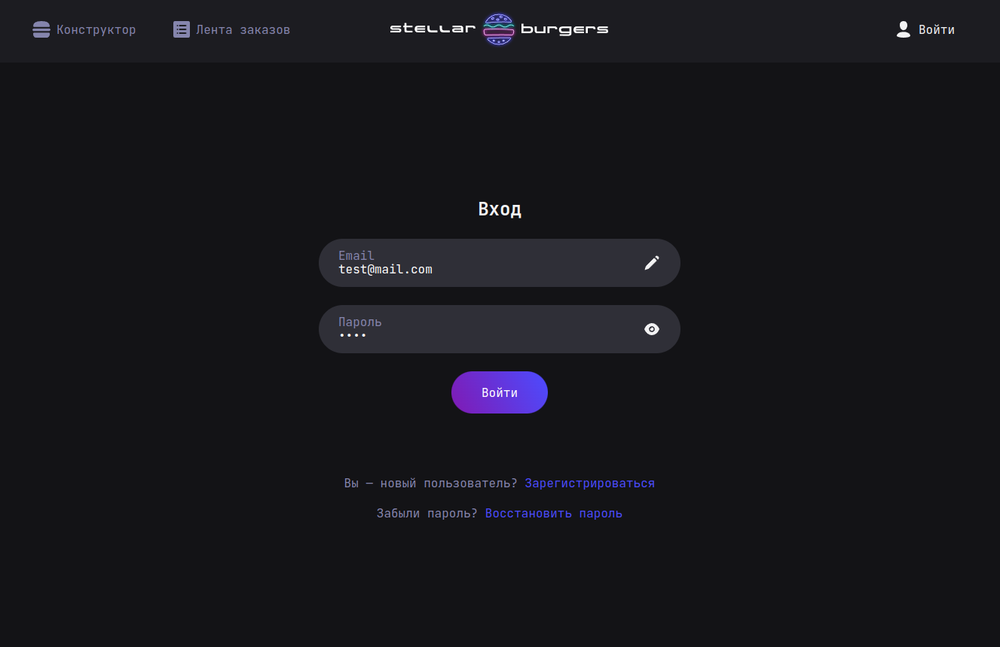

<a href="https://feature-sliced.design/ru/docs/get-started/overview">
  
</a>

# Космический Бургер

Учебный проект фронтенда футуристической бургерной. Я пошёл сильно дальше учебного брифа. В работе
использовал самые новые инструменты и подходы.
[Макет figma](<https://www.figma.com/file/ocw9a6hNGeAejl4F3G9fp8/React-_-%D0%9F%D1%80%D0%BE%D0%B5%D0%BA%D1%82%D0%BD%D1%8B%D0%B5-%D0%B7%D0%B0%D0%B4%D0%B0%D1%87%D0%B8-(3-%D0%BC%D0%B5%D1%81%D1%8F%D1%86%D0%B0)_external_link?node-id=849%3A1315&t=LLydQv2OA4D4NX2L-0>)

<video controls src="https://github.com/user-attachments/assets/9e3cad75-9249-457f-ba85-abd0f42b73b8" title="Демонстрация работы фронтенда"></video>



|                                                         |                                                       |                                                     |
| :-----------------------------------------------------: | :---------------------------------------------------: | :-------------------------------------------------: |
|  |          |  |
|                |  |       |

## Крутые решения

:boom: Использовал [Data API](https://reactrouter.com/en/main/start/overview#data-loading)
`React router v6.4` для загрузки данных на уровне роутера, а не на уровне компонентов. Это
освобождает компонент от обслуживания загрузки и отслеживания состояния. Компонент начинает сразу же
рендериться, все данные ему предоставляет роутер. И это ускоряет загрузку для вложенных роутов.

:boom: [`TanStack Query`](https://tanstack.com/query/latest) (бывший React Query) для асинхронного
стейт менеджмента загружаемых данных на уровне роутера. Он оказался прозрачнее, чем Redux Toolkit
Query при использовании с Data API роутера.

:boom: Redux только для синхронного стейт менеджмента - для обслуживания корзины

:boom: Впервые опробовал архитектурную методологию проектирования фронтеда
[FSD](https://feature-sliced.design/ru/docs). Очень вдохновил подход по структуризации проекта.
Стало сильно понятнее, где что искать, когда проект стал большим. У ребят вышел линтер по
методологии, который ещё не успел опробовать.

:boom: К проекту была
[библиотека компонентов](https://www.npmjs.com/package/@ya.praktikum/react-developer-burger-ui-components),
но меня она не устроила гибкостью и семантичностью вёрстки. Поэтому все компоненты пересобрал сам,
используя лучшую семантику. Например, компонент `Tab` был свёрстан через простой `<div>`, но лучшая
практика - это `<button>` для лучшей доступности.

:boom: Поработал с i18n. Использовал пакеты `i18next`, `i18next-browser-languagedetector` и
`i18next-http-backend`. Но не успел вывести смену языка фронтенда на кнопку. Пока работает только
как квери запрос. Переводы приходят в виде `json` файла Доступа к бэкенду не было, поэтому
локализовать ингредиенты не вышло, но знаю, как сделать это на стороне сервера. Есть опыт.

<video controls src="https://github.com/user-attachments/assets/52236756-ea50-4113-bf91-fe45fb3e6673" title="i18n"></video>

:boom: Использую [`Zod`](https://zod.dev/) и [`React Hook Form`](https://www.react-hook-form.com/)
для валидации и отправки форм. Мощные и гибкие инструменты. `React Hook Form` понравился больше, чем
`Formic`.

<video controls src="https://github.com/user-attachments/assets/24666a44-68eb-4cc7-b968-1346d3f36c24" title="Zod & React Hook Form"></video>

:boom: Попробовал современный пакет для Drag & Drop [`dnd kit`](https://dndkit.com/). Много
настроек, красивый визуал получается.

## Планы по развитию

1. Добавить отдельное приложение для мобильной версии, потому что вёрстка очень сильно оличается.
   Дотюнить тач скрин Drag & drop.
2. Создать монорепозиторий на основе `Nx`, чтобы вынести общие типы и компоненты в отдельные пакеты
   и переиспользовать в приложениях.
3. Внедрить [линтер FSD](https://github.com/feature-sliced/steiger) и дотюнить структуру проекта.
4. Внедрить [`Storybook`](https://storybook.js.org/) для библиотеки компонентов
5. Внедрить [`Cypress Component Testing`](https://docs.cypress.io/guides/component-testing/overview)
   для тестирования и разработки компонентов

## Local Development with Docker

```sh
git clone git@github.com:gvozdenkov/stellar-burgers.git

cd stellar-burgers

cp .env.example .env

docker compose -f compose.dev.yaml up --build
# or with Makefile
make run-dev

# view app on http://localhost:8081/

# create a new branch, commit in it and then create PR to main
```

## Tech stack

- React with TS
- Redux (for local state management)
- TanStack (for server state management)
- React router v6 (new features: actions and loaders)
- React hook form and Zod to control forms
- SCSS
